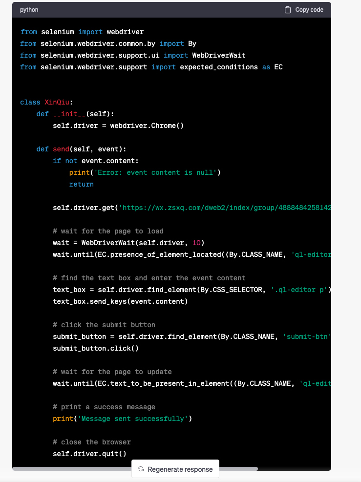
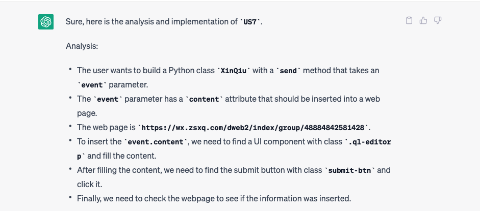
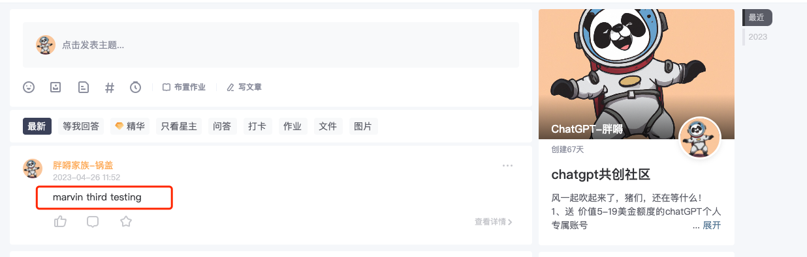

## write a sender to login in xin qiu and send updates

```text

i have one user story need your help.

User Story:  `US7`
description: i want build a python class `XinQiu.py`, by invoking method `send` with parameter `event`
Acceptance Criteria:
    1. given event.content = null, should return error and log errors
    2. given event.content = `test`, should send successfully


implementation strategy:

1. open web page `https://wx.zsxq.com/dweb2/index/group/48884842581428` 
2. find a UI component `<p>` by class `.ql-editor p`
3. fill `event.content` under `<p>` in second step
4. find submit button `submit` by class `submit-btn`
5. click `submit` button
6. check webpage if information inserted 

could you help me analysis the `US7` and use python implement it

```




### 最终效果



### 加入星球学习更多、相互交流、谈合作

* ChatGPT帮我实现React前端项目
* ChatGPT帮我实现Python项目
* ChatGPT帮我实现Java后端项目
* [高阶] ChatGPT帮我实现Visual Studio Code插件
* [高阶] ChatGPT帮我实现Python爬虫
* [高阶] ChatGPT帮我实现自动发微信公众号
* [高阶] ChatGPT帮我实现自动发星球动态
* [高阶] ChatGPT帮我爬油管、创造短视频
* [高阶] ChatGPT帮我发送抖音和Tiktok
* 更多课程等你来参与~


### 微信加好友了解细节
